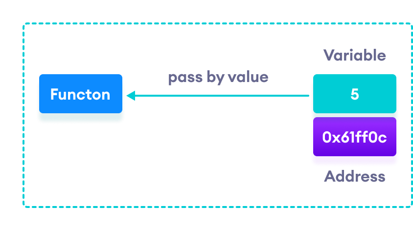

# Pass-By-Value-And-Reference

Arguments can generally be passed to function in one of the following two ways

- Pass by value(call by value)
- Pass by reference(call by reference)

### Pass by Value

In this method, the value of each of the actual arguments in the calling function is copied into corresponding formal arguments of the function. With this method the changes made to the formal arguments in the called function have no effect on the value of actual arguments in the calling function.

In the above diagram the value contain by the variable is passed to a function, the separate block of memory is reserved.

If we do any change in the value of the variable then there is `no effect in the value of variable inside of the function` because Pass by value means that `a copy of the actual parameter’s value is made in memory,` i.e. the `caller(the caller is a function that calls another function.)` and `callee(Callee is a function called by another)` have two independent variables with the same value. If the callee modifies the parameter value, the effect is not visible to the caller.

### Pass by Reference

In this method, the addresses of the actual arguments in the calling function are copied into formal arguments of the called fuction. This means that using these addresses we would have an actual arguments and hence we would be able to manipulate them

In the above diagram the address in which the variable is store is passed to the function, both the arguments and parameter use same memory block of memory by different reference variables.

### Illustration By Example:

Let us consider a following example

    #include<stdio.h>

    int main(){

        int a=5,b=10;

        swap(a,b);

        printf("%d      %d",a,b);

      return 0;

    } 

    void swap(int a,int b){

      int temp;

      temp =a;

      a=b;

      b=temp;

    }

**Output: 5    10**
